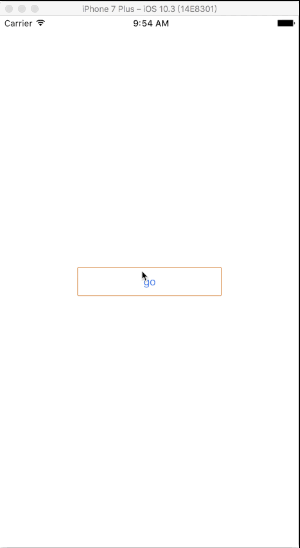

# CCPopUpNavController


## Description
*CCPopUpNavController* is a pop-up view, the type is a NavigationController,through a new controller as the CCPopUpNavController's rootviewcontroller can be easily placed in which you want the view or control, easier to achieve the desired effect 


## screenshot



## Install

Copy the source code in you project

You can copy the `CCPopUpNavController` folder and its source file `CCPopUpTransition.swift`,`CCPopUpNavController.swift` in your project.

##Usage

###You must set the CCPopUpNavController.view.frame. the height is the pop view's visible height

```swift

/// useage 1
let ccnavi = CCPopUpNavController(rootViewController: vc)
///must set CCPopUpNavController.view.frame
ccnavi.view.frame = CGRect(x: 0, y: 0, width: view.frame.width, height: 400)

```

or

```swift

/// useage 2
//        let ccnavi = CCPopUpNavController(rootViewController: vc, configuration: CCPopUpNavController.optionalValue(tapDismissEnable: true, annimationDuration: 0.35, backgroundShadeColor: UIColor.black, scaleTransform: CGAffineTransform(scaleX: 0.94, y: 0.94), springDamping: 0.88, springVelocity: 14, backgroundShadeAlpha: 0.4))
 /// must set CCPopUpNavController.view.frame
//        ccnavi.view.frame = CGRect(x: 0, y: 0, width: view.frame.width, height: 400)

```


## MIT License

Copyright (c) 2017 Desgard_Duan

Permission is hereby granted, free of charge, to any person obtaining a copy
of this software and associated documentation files (the "Software"), to deal
in the Software without restriction, including without limitation the rights
to use, copy, modify, merge, publish, distribute, sublicense, and/or sell
copies of the Software, and to permit persons to whom the Software is
furnished to do so, subject to the following conditions:

The above copyright notice and this permission notice shall be included in all
copies or substantial portions of the Software.


